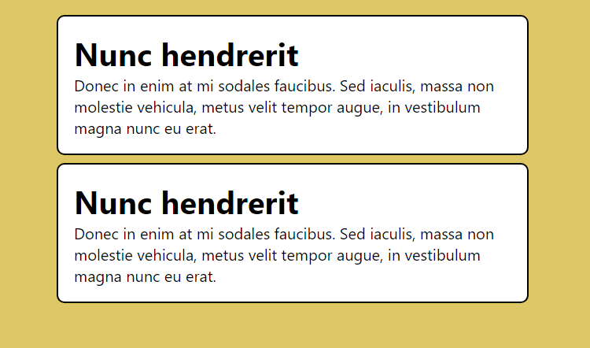

# React-komponentin toteuttaminen

Tässä tehtävässä toteutetaan yksinkertainen käyttöliittymissä esiintyvä korttikomponentti. Huomaa, että tässä tehtävässä css-tyylimääritteet on määritelty valmiiksi, kortti näyttää 
automaattisesti esimerkin mukaiselta, kun toteutat komponentin ohjeiden mukaisesti.

 1. Asenna tehtäväprojektin käyttämät node-paketit suorittamalla projektikansiossa komento 

    ```
    npm install
    ```

    Jos käytät Visual Studio Codea tekstieditorina, niin voit avata projektikansion komennolla
    
    ```
    code .
    ```

    Tämän jälkeen voit käynnistää kehitysympäristön komennolla 

    ```
    npm run dev
    ```


 2. Toteuta *src/App.jsx*-tiedostoon React-komponentti **Kortti**, joka sisältää `Kortti`-luokkaan kuuluvan `div`-elementin. Sijoita div-elementin sisälle `h1`-otsikkoelementti sekä tekstikappale. Otsikon ja tekstin sisällöt saat valita vapaasti.

 3. Kutsu toteuttamaasi Kortti-komponenttia vähintään kerran App-komponentin sisällä. 

    Voit testata paikallisesti täyttääkö tekemäsi komponentti vaaditut kriteerit komennolla

    ```
    npm test
    ```

Alla on esimerkki sivusta, joka täyttää vaaditut kriteerit.

